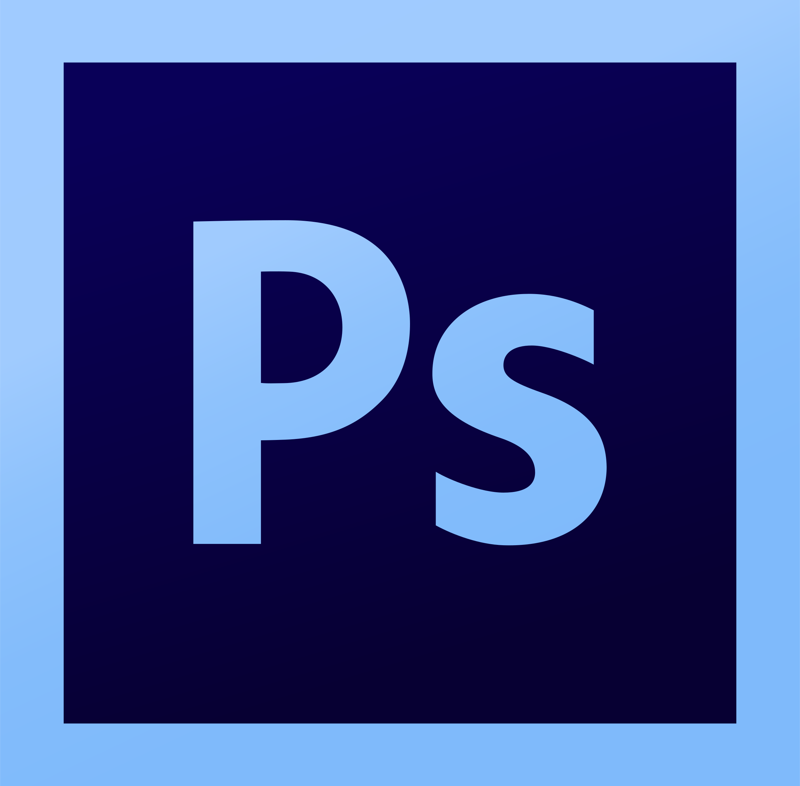
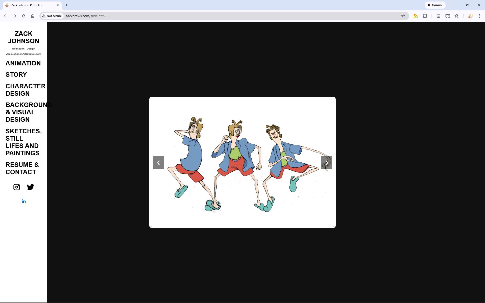
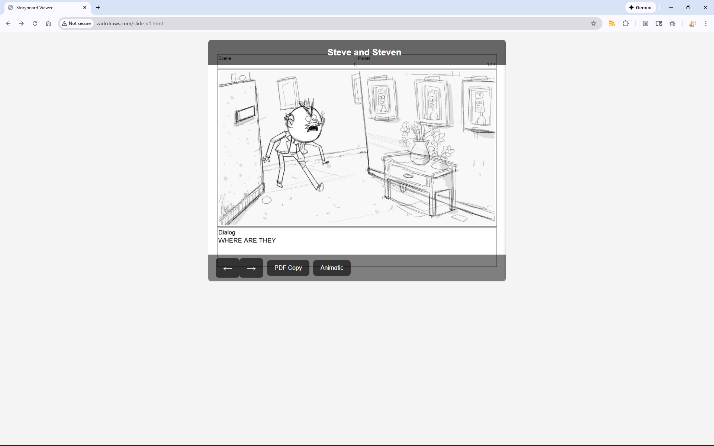
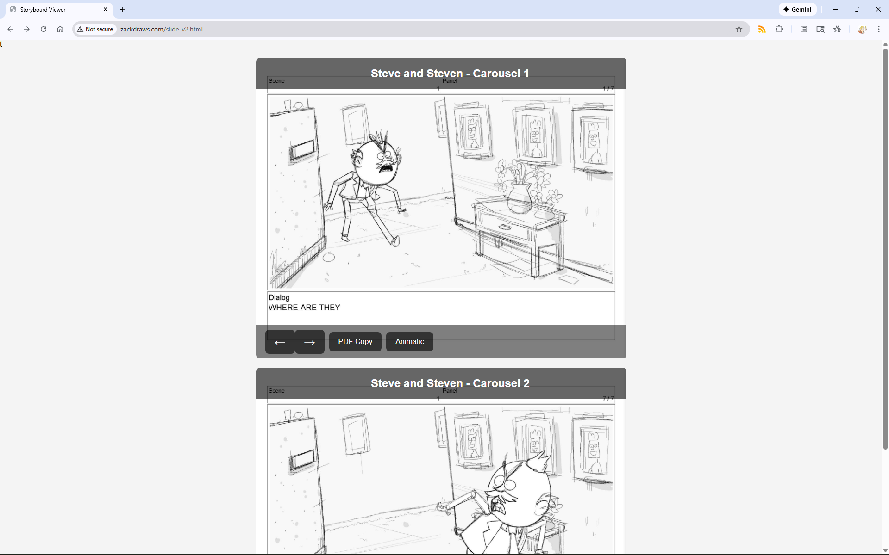
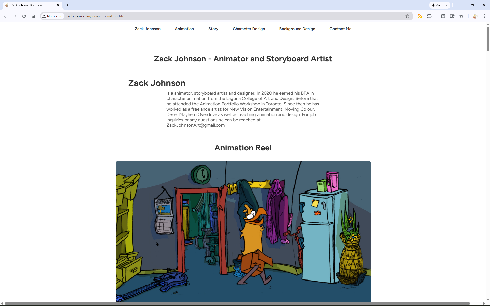

# Portfolio Site Project -
- JS 	    - holds javascript
- PORTFOLIO - html sites
- WORK 	    - links to the data
- CSS  	    - css       

## . PORTFOLIO ( HTML )
### HTML
1. <!DOCTYPE html> */ let the browser know this is html
2.  link rel="stylesheet" href="css.css" */ - provides the html page with a link to the css, which is the recipe for the design of the html.
3. </head> */for header
4. <body> */for the body of the website
5. <nav class="navbar"> this creates the navbar
6. - ul -
7. <li><a href="____">______</a></li> this is for the link to by clicking this it will go to where the link is - by going to the section id 
   div elements are linked from the css so the html knows how to display the information. 
8.     - grid - it is for the grid and then has grid-item for each photo
9.     - h1 - the h is to create different text sizes so h1 could be for a large text
10.   - h2 - medium text
11.   - h3 - for small text 
12.   - container - provides margins to the page and frames the content
13.   - about text - for text being in the center
14.   - about container - is so that the text stays in the center of the page
15.   - css pages that change the style are located in /css/
### WORK
     holds all of the image files
#### Resume
- zack_johnson_resume.md - my resume as a markdown file
- zack_Johnson_Resume.pdf - my resume as a pdf
##### Animation Reel (ANP.mp4 in file directory)
##### Story Portfolio (PDFs in file directory)
##### Character Design (cd01.jpg, cd02.jpg, cd03.jpg ... etc.)
##### Background and Viz Dev (bg01.jpg, bg02.jpg, bg03.jpg ... etc)
## Website Styling
### HTML-  Naming Files in Portfolio
Portfolio images are in the folders /cd /bg and /fg 
files are labeled cd_01.jpg bg_01.jpg fg_01.jpg 
	- cd_01.jpg (Files for character design) 
	- bg_01.jpg (Files for Background), 
	- fg_01.jpg (Files for Sketchbook) 
	- 1/fund_01.jpg
#### CSS - 
     - bundles.css - bundled all css into one
### JS - javascript
      - lightbox.js
      - closer.js
# How:
## 1. Git (version control of site)
1. Install Git 
   - Git install http://git-scm.com
   - git is used for version control and can be used to clone this repository 
   - easily clone this repository if you were me and wanted to just remake this exact site or you can gh repo fork.  
   - zackdraws/zackdraws.github.io to make a fork of your own and then just easily rewrite the files to match your own website.
   
1.1.2 Hosting your code - Make a github account -
    - host the site on github, codeberg, gitlab or other
    - Use git to get the folder directory repository from the source and it is also how your computer pulls changes, commits changes and pushes those changes to the site server.
## Git Clone or Fork
### 1.2.1- Clone - 
git clone http://github.com/zackdraws/zackdraws.github.io.git
1.2.2     'cd zackdraws.github.io to change the directory to the repository you just created. 
	  Once you do this you will be in the local folder of the site on your computer.
	  *      cd means change directory
1.2.3. git commands - in order to make changes in git through the terminal you can type git <command>
        examples ---
       - git pull - pulls any updates that have been made 
       - git add . - adds all file changes that have been made
       - git commit - commits any changes made that have been added
       - git commit -m "message " - commits and attaches a message
       - git push - pushes changes to repository
Alternatives: github desktop or vscode or emacs and magit. 
### 1.3.1 Fork 
    - a fork is like a fork in the road. The fork is its own seperate directory that you can make changes to and make your own. 
    - Once you make a fork change all of the image files but do not change the file names.
    - The file names need to be the same so that the website still references the site. 
- > gh repo fork zackdraws/zackdraws.github.io
# Programs used-
## Code Editors - 
### Emacs 

text editor - for editing code and also displaying previews
### - Visual Studio Code -

text editor that's much simpler than emacs and works outside of the box
## Art Programs
### Photoshop

### Clip Studio Paint

### Procreate

## Animation Programs
### TVPaint

### ToonBoom Harmony

## Storyboard Programs
### ToonBoom Storyboard Pro

### Adobe Photoshop

# Image Previews

