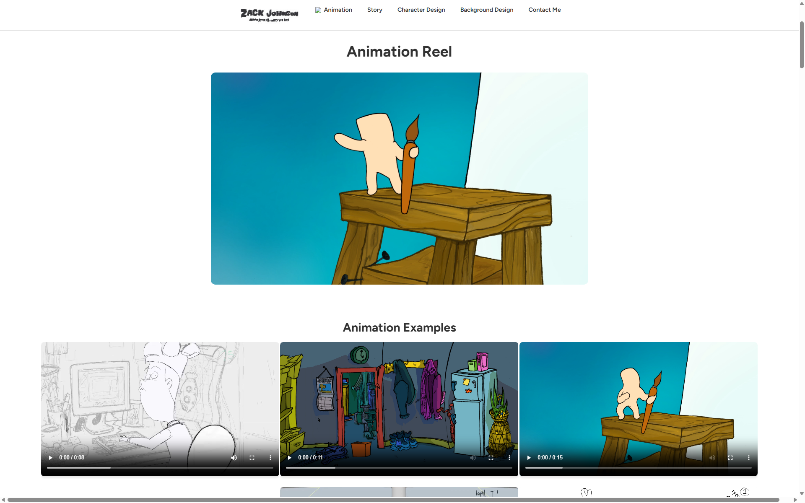
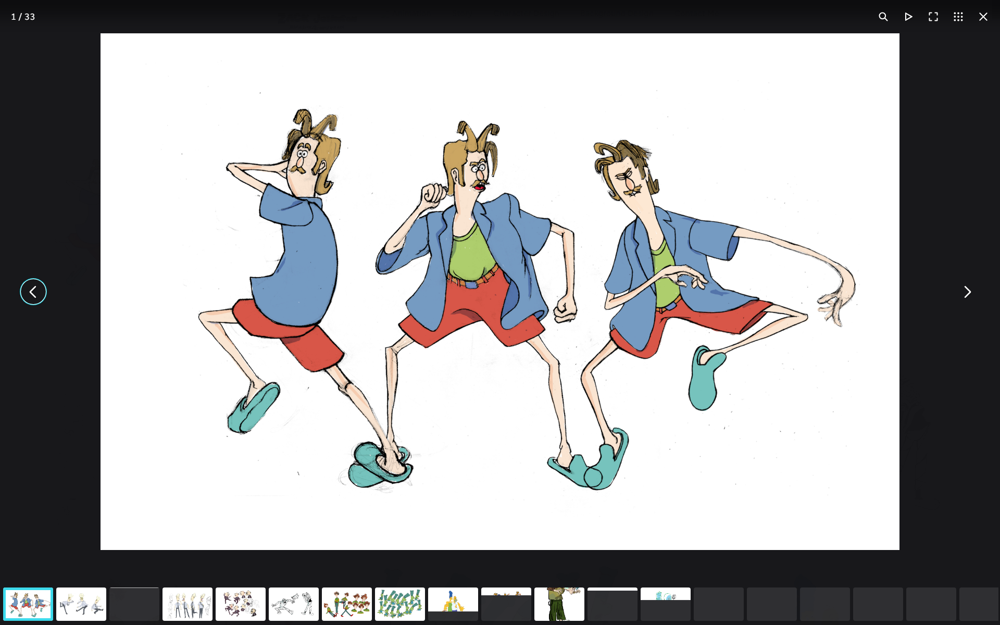
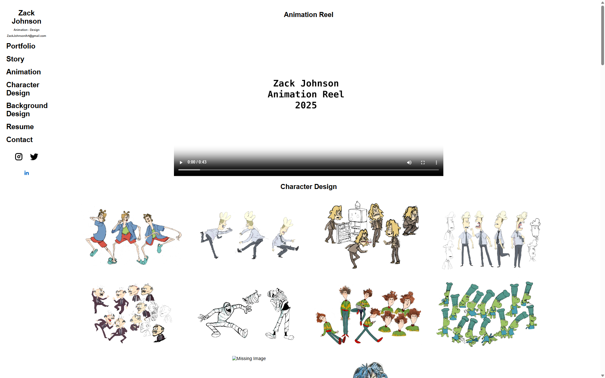

# Portfolio Site Project -
 - About: This is my portfolio site project hosted on github and made up of html and css. The site itself can be found at http://zackdraws.com 

- Why: When I was working on my site in squarespace I got sick of losing a lot of time updating the folder and add each file one at a time. Using Squarespace felt like I was building on something that I was going to have to rely on more and more and it felt like I could easily make a web template with the same qualities on my own.
 
# 1. Git (version control of site)
The first program I started using was Visual Studio Code (https://code.visualstudio.com/). From there you can look and edit your code and install live preview as a plug in. Live Preview makes it possible to view your site as you edit. 

Now I have eMacs and use m-x http-d serve directory to have a preview of the site. 

Before using visual studio code 
1. Install Git 
   - Git can be installed from http://git-scm.com and can be used in the cmd terminal, emacs or vscode.
   
   - git is the tool for version control and cloning this repository so you can easily clone this repository if you were me and wanted to just remake this exact site or you can gh repo fork zackdraws/zackdraws.github.io to make a fork of your own and then just easily rewrite the files to match your own website.
   
   - While this repo is installed on github git is seperate than github and the code can be ran on different sources but this repository can be downloaded through the github repository

   - Once git is installed you can use Microsoft VSCode to make changes to the site  
1.1.2 Make a github account -
    - for a site you will need to host your website github is one of the most common and also has Github Desktop which makes this easier to set up.
    - once you make a website you can host the site on github through a public or private repository. 
## What is Git? 
Git is how your computer gets the folder directory repository from the source and it is also how your computer pulls changes, commits changes and pushes those changes to the site server.
## Git Clone or Fork
### 1.2.1- Clone - 
git clone http://github.com/zackdraws/zackdraws.github.io.git
     cloning the file directory will install the repository in the directory that you are inside your terminal.
     when you open the terminal from your computer it usually will go to the user directory of your computer.
1.2.2     type -> 'cd zackdraws.github.io' to change the directory to the repository you just created. Once you do this you will be in the local folder of the site on your computer.
*      cd means change directory
1.2.3. git commands - in order to make changes in git through the terminal you can type git <command>
        examples ---
       - git pull - pulls any updates that have been made 
       - git add . - adds all file changes that have been made
       - git commit - commits any changes made that have been added
       - git commit -m "message " - commits and attaches a message
       - git push - pushes changes to repository
       but if you do not want to use git in the terminal you can also just use github desktop or vscode or emacs and magit. 
### 1.3.1 Fork 
- a fork is like a fork in the road. The fork is its own seperate directory that you can make changes to and make your own. 
- Once you make a fork change all of the image files but do not change the file names. The file names need to be the same so that the website still references the site. 

- > gh repo fork zackdraws/zackdraws.github.io

from the terminal in your ~/ user directory or whereever you want to store it
or you can click the fork button. 

### 1.4 Using Git -
When I first started using git I did not understand why or how it worked I just knew that's what you use. But basically you use git to add changes then you commit those changes with a commit message explaining what you changed. Finally you push the changes to merge the changes to the official site. If you make a mistake you can git restore from an earlier version. I've used github desktop, vscode's github plug in and git with magit and lastly git terminal, I would recommend to use git terminal the most but vscode's git is the easiest to understand and is the most visual.

### 1.4 Making changes to push to Git
- to make changes to the site you can use any text editor to change the html or css files, you just have to push the changes through git

# 2. Design 
While designing the site I tried to focus mostly on just showing the work and avoiding white space. However I have made different templates depending on what is important - as long as the references are not moved and match the file locations they will fit into the page for the area they're labeled. Background examples are in the bg folder character designs are in the cd folder so you can change the names to what you want them to be, but you have to make them match for them to show up in the right place.

## 2. 1 Horizontal view (Index.html)
This is the version of the site that is horizontal and has a navigation bar at the top of the page.

### 2. 2 Lightbox -

## 2. index_2025_Vertical_w_sidebar.html
- this is a template design that has the sidebar to the left side and follows with the art samples.

### -
- all.html - a page that includes everything
- animation.html - my animation
- backgrounddesign.html - background designs
- characterdesign.html - character design page
- fundamentals.html - is a page of my fundamentals ( still life drawings, figure drawing etc.)
- index03.html - test where it's a grid view of all the videos
- index2.html -test without sidebar and has a big video and then the videos underneath are all much smaller
- index5.html - this is a splash page test 
- indexwoimages.html - this is another splash page test - much cleaner
- index_with_no_images_hover.html
- resume.html- a page that has about me and my resume.sh - this is a script to create a resume - it doesn't work well
- sb.html - this is where my storyboarding page is
- sb02.html - this is where my second storyboaring page is
- story.html - this is another storyboarding html page
- story_02.html - custom storyboard viewer
- story_04.html - custom storyboard viewer 02
- story_04_07.html - w/o custom storyboard viewer
- story_styles.css - storyboard styles page

## 3. HTML Structure

### HTML
each doctype file starts with 
1. <!DOCTYPE html> */ this is to let the browser know this is html
2.  link rel="stylesheet" href="css.css" */ this provides the html page with a link to the css, which is the recipe for the design of the html.
3. </head> */for header
4. <body> */for the body of the website
5. <nav class="navbar"> this creates the navbar
6. - ul -
7. <li><a href="____">______</a></li> this is for the link to by clicking this it will go to where the link is - by going to the section id 
< --- div elements -- >
div elements are linked from the css so the html knows how to display the information. 
8. - grid - it is for the grid and then has grid-item for each photo
9. -  h1 - the h is to create different text sizes so h1 could be for a large text
10. - h2 - medium text
11. - h3 - for small text 
12. - container - provides margins to the page and frames the content
13. about text - for text being in the center
14. - about container - is so that the text stays in the center of the page
15. - css pages that change the style are located in /css/

### References
- The html references to files inside of the directory for example the site uses 'zack_johnson_resume.pdf' as a source. By doing this the html file is able to display the referenced file. If the name of the file is changed the html won't be able to reference it. For example in a fork you can drag your own resume change into the folder change the name to match in the html and then it will show that resume. The same goes for all images.

#### Pages - 
> these are pages that I still need to describe more and where they fit into the design of the site.

- styles.css - index styles.css
- stylesstory.css - story.css
- styles_index.css - index page css
- zack_johnson_resume.md - my resume as a markdown file
- zack_Johnson_Resume.pdf - my resume as a pdf
- Index.html homepage
- Animation

##### Animation Reel (ANP.mp4 in file directory)

##### Story Portfolio (PDFs in file directory)

##### Character Design (cd01.jpg, cd02.jpg, cd03.jpg ... etc.)

##### Background and Viz Dev (bg01.jpg, bg02.jpg, bg03.jpg ... etc)

## Website Styling

### HTML-  Naming Files in Portfolio

My Portfolio images are in the folders /cd /bg and /fg 
files are labeled cd01.jpg bg01.jpg fg01.jpg 
	- cd_01.jpg (Files for character design) 
	- bg_01.jpg (Files for Background), 
	- fg_01.jpg (Files for Sketchbook) 
	- 1/fund_01.jpg

### Styles.css
Styles.css isn't an html website page it controls the settings of the html
Styles controls the css of website

### JS
For the lightbox feature to work I just used the lightbox js and it connects through the html on the site
        - Lightbox.js = javascript for 'lightbox' effect

# Programs used-
## Code Editors - 
### Emacs 

text editor - for editing code and also displaying previews
### - Visual Studio Code -

text editor that's much simpler than emacs and works outside of the box
## Art Programs
### Photoshop

### Clip Studio Paint

### Procreate

## Animation Programs
### TVPaint

### ToonBoom Harmony

## Storyboard Programs
### ToonBoom Storyboard Pro

### Adobe Photoshop

## Compositing
### Indesign
### Premiere 

# Questions

What is Emacs Backtrace ?
if this is in the directory that is just an emacs crash file